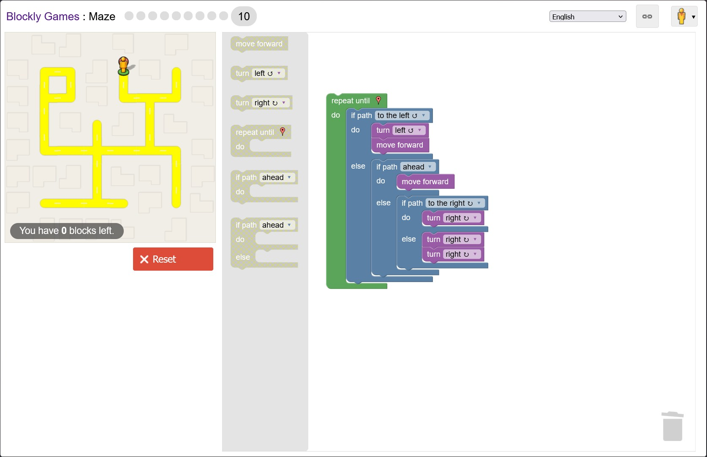
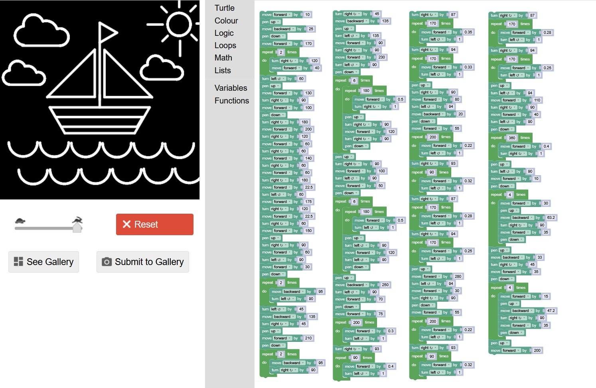

# **TPC1 - Maze nível 10 e Desenho**

### __Autor:__
 Ricardo Afonso Silva de Faria, A110398 
 
 

### __Resumo:__
 O primeiro TPC é a resolução do nível 10 do Maze e de fazer um desenho no Turtle no site do block party.

### __Resultados:__
 
 